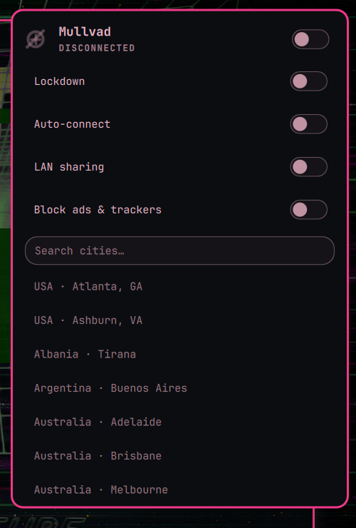

# Mullvad for Omarchy

A status-bar plugin for [Omarchy](https://omarchy.org) Quattro that puts Mullvad VPN on the desktop instead of in a terminal.

Click the themed mark to see whether you are connected, pick a city, turn the tunnel on or off, log in with your account number, and toggle lockdown. Right-click the icon to connect or disconnect without opening the panel. It talks to the official `mullvad` CLI, so the daemon you already trust is still what is running.



## Install

```bash
omarchy plugin add https://github.com/Aweiward/omarchy-mullvad.git --enable
```

If `mullvad` is missing, open the widget and click **Install Mullvad**. That runs `omarchy pkg add mullvad-vpn-daemon` (Arch extra, via Omarchy’s usual privilege prompt) and starts `mullvad-daemon.service`. It will not remove the official Mullvad app if you already have it.

## Remove

```bash
omarchy plugin remove aweiward.mullvad
```

That disables the widget and deletes the plugin checkout. It does **not** uninstall `mullvad-vpn-daemon`, stop the Mullvad daemon, log you out of Mullvad, or change other Omarchy config.

## Use

- Left click: panel
- Right click: connect / disconnect (opens the panel if you are logged out)
- Middle click: refresh
- Panel: account number login, city search, lockdown, log out

Keys inside the panel: `j`/`k` move, Enter selects, `/` search, `t` tunnel, `l` lockdown, Esc closes.

## Requirements

- Omarchy 4 (Quattro) / `omarchy-shell`
- `mullvad` 2026.3+ (installed for you from the panel if missing)

## Dev

```bash
node --test tests/*.test.js
tests/cli-contract.sh
```

`cli-contract.sh` is read-only. It never connects, disconnects, logs in, or logs out.
